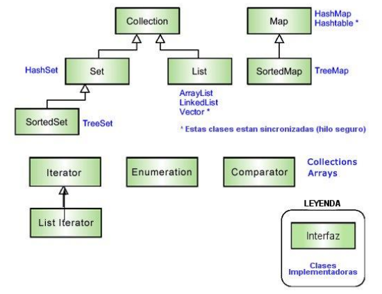

## Explicacion de COLECCIONES en java:  

  
 + Tomando como referencia la imagen se explicaran a continuacion los conceptos tratados.   

### 1. Qué representa el diagrama (leyenda)  

Interfaz: define comportamiento (métodos) sin implementación (por ejemplo List, Set, Map).

Clases implementadoras: clases concretas que implementan la interfaz (por ejemplo ArrayList, HashSet, HashMap).

La imagen también marca con un asterisco las clases sincronizadas (seguras para hilos) en la implementación clásica.

### 2. Interfaces principales  

* Collection
	+ Es la interfaz raíz para colecciones de elementos (listas, conjuntos, colas). Define operaciones básicas: add, remove, contains, size, iterator, etc.
[Nota]: Map no extiende Collection (es una estructura de pares clave-valor distinta).

* List
	+ Una colección ordenada con índices (posiciones). Permite duplicados y acceso por índice.
	+ Implementaciones típicas: *ArrayList*, *LinkedList*, *Vector*.
	+ Operaciones típicas: `get(index)`, `add(index, e)`, `remove(index)`, `set(index, e)`.

* Set
	+ Colección que NO permite duplicados (cada elemento es único). No asegura orden (depende de implementación).
	+ Implementaciones típicas: *HashSet*, *TreeSet*.
	+ SortedSet y NavigableSet
	+ **SortedSet** extiende Set y mantiene los elementos en orden. **NavigableSet** añade operaciones como `lower()`, `higher()`, `ceiling()`, `floor()`.
	+ Implementación habitual: TreeSet (orden natural o con Comparator).

* Map
	+ Estructura de pares clave → valor. No es Collection. Operaciones: `put, get, remove, containsKey, keySet, values, entrySet`.
	+ Implementaciones: *HashMap*, *TreeMap*, *Hashtable*.
	+ SortedMap y NavigableMap
	+ **SortedMap** mantiene las claves ordenadas; **NavigableMap** añade métodos de navegación. Ejemplo: TreeMap.

### 3. Implementaciones importantes (qué hacen y cuándo usarlas)  

* ***ArrayList*** -> list
	+ Implementa List con un array dinámico.
	+ Acceso por índice: O(1). Insertar/Eliminar en medio: O(n).
	+ add(e) al final es amortizado O(1).
	+ No es sincronizada (si necesitas sincronía usar Collections.synchronizedList(...) o clases de concurrencia).
	+ Uso: cuando necesitas acceso rápido por índice y pocas inserciones/remociones en medio.

* ***LinkedList*** -> list
	+ Implementa List (y Deque) como lista doblemente enlazada.
	+ get(i) es O(n) (malo para acceso aleatorio). Insertar/remover al principio/fin es O(1).
	+ Útil para colas/deques o cuando haces muchas inserciones/remociones en extremos.

* ***Vector*** -> list
	+ Similar a ArrayList pero sincronizado (legacy). Hoy en día se evita en favor de ArrayList o colecciones concurrentes.
	+ Tiene capacityIncrement y métodos heredados.

* ***HashSet*** -> set
	+ Backed por un HashMap internamente. No permite duplicados.
	+ Operaciones add, contains, remove promedio O(1) (depende de hashCode() y equals()).
	+ Desordenado: el orden no está garantizado.
	+ Permite un null (sí, HashSet acepta null).

* ***TreeSet*** -> set
	+ Implementa `SortedSet` (usualmente un árbol rojo-negro). Operaciones O(log n).
	+ Mantiene los *elementos ordenados* (por orden natural o por Comparator).
	+ No permite null si la comparación no soporta null (con orden natural null provoca NullPointerException).

* ***HashMap*** -> map
	+ Implementa Map con hashing. put, get, remove promedio O(1) (a depender de hashCode()).
	+ Permite una clave null y valores null.
	+ No ordenado.

* ***Hashtable*** -> map
	+ Versión antigua y sincronizada de HashMap. No acepta claves ni valores null.
	+ Hoy en día se prefiere HashMap + sincronización externa o ConcurrentHashMap.

* ***TreeMap*** -> map
	+ Implementa SortedMap con árbol (O(log n)). Mantiene las claves ordenadas.
	+ No permite null si la comparación natural no lo acepta.

### 4. Iteradores y enumeraciones (recorrido de colecciones)  

* **Iterator<E>**
	+ Métodos: hasNext(), next(), remove() (este último elimina el elemento retornado por next() de forma segura).
	+ La mayoría de iteradores son fail-fast: si la colección se modifica estructuralmente fuera del iterador (p. ej. desde otro hilo o con collection.remove(obj)), el iterador detecta y lanza ConcurrentModificationException. La excepción es detección, no garantía de corrección concurrente.
	+ El bucle for-each usa internamente un Iterator.

* **ListIterator<E>**
	+ Extiende Iterator para listas: hasPrevious(), previous(), nextIndex(), previousIndex(), add(e), set(e). Permite iterar en ambos sentidos y modificar la lista durante la iteración de forma controlada.

* **Enumeration**
	+ Interfaz antigua: hasMoreElements(), nextElement(). Usada por Vector, Hashtable antiguamente.
	+ No soporta remove() y no es fail-fast (no detecta modificaciones concurrentes). Hoy en día se prefiere Iterator.

### 5. Comparable vs Comparator  

* **Comparable<T>:** 
	+ La clase T implementa compareTo(T o) → define su orden natural. Ej:  
~~~java
class Persona implements Comparable<Persona> { ... public int compareTo(Persona o) { return this.edad - o.edad; } }.
~~~
* **Comparator<T>:** 
	+ Objeto externo que define un orden distinto. Es útil cuando no puedes modificar la clase o necesitas varios criterios. Es una interfaz funcional (se puede usar lambda).
	+ Se usan con Collections.sort(list) o list.sort(comparator) y con TreeSet, TreeMap al pasar un Comparator.
	- Ejemplo rápido Comparator (Java 8+):
~~~java
List<String> lista = Arrays.asList("manzana","pera","uva");
lista.sort(Comparator.comparingInt(String::length)); // ordena por longitud
~~~

### 6. Clases utilitarias: Collections y Arrays  

* **Collections (con 's')**
	+ Es una clase de utilidades para trabajar con colecciones: sort, binarySearch, shuffle, reverse, synchronizedList, unmodifiableList, emptyList, etc.
	- Ejemplo: `List<String> sync = Collections.synchronizedList(new ArrayList<>());`
		- Ojo: cuando iteres sobre sync debes sincronizar externamente:
~~~java
synchronized(sync) {
    for (String s : sync) { ... } // evitar concurrent modification
}
~~~
* **Arrays**
	+ Utilidades para arreglos: sort, binarySearch, asList, copyOf, etc.
	+ Arrays.asList(...) produce una lista fija (vista sobre el array), ojo con add/remove (lanzan UnsupportedOperationException).

### 7. Comportamientos importantes y recomendaciones prácticas  

+ Elegir por uso:
	- Necesitas acceso por índice frecuente → ArrayList.
	- Muchas inserciones/eliminaciones por los extremos → LinkedList o mejor ArrayDeque.
	- No quieres duplicados → HashSet (rápido) o TreeSet (si necesitas orden).
	- Map clave→valor sin orden → HashMap. Si necesitas orden por clave → TreeMap.
	- Nulls: HashMap permite null key/values; Hashtable no. TreeMap/TreeSet con orden natural no aceptan null.
	- Concurrencia: evitar Vector y Hashtable hoy en día; usar Collections.synchronized* o mejor java.util.concurrent (ConcurrentHashMap, CopyOnWriteArrayList, etc.) según necesidad.
	- Iteradores: usa Iterator.remove() para eliminar mientras iteras; no modifiques la colección por fuera o lanzará ConcurrentModificationException (fail-fast).
	- Rendimiento: Hash* (map/set) tiene accesos promedio O(1); Tree* O(log n). ArrayList es excelente para lectura y acceso aleatorio.

### 8. Ejemplos cortos (Java) — uso y diferencias

~~~java
// ArrayList vs LinkedList
List<Integer> al = new ArrayList<>();
al.add(1); al.add(2); al.add(0, 99); // get rápido

List<Integer> ll = new LinkedList<>();
ll.add(1); ll.add(2);
((LinkedList<Integer>)ll).addFirst(0); // insertar al inicio es O(1)

// HashSet
Set<String> hs = new HashSet<>();
hs.add("a"); hs.add("b"); hs.add("a"); // solo queda "a","b"

// TreeSet con Comparator
Set<String> ts = new TreeSet<>(Comparator.reverseOrder());
ts.addAll(Arrays.asList("b","a","c")); // orden inverso: c,b,a

// HashMap
Map<String,Integer> map = new HashMap<>();
map.put("uno",1); map.put("dos",2);
int v = map.get("uno");

// Iterador seguro para eliminar
Iterator<String> it = hs.iterator();
while(it.hasNext()){
    String s = it.next();
    if (s.equals("b")) it.remove(); // correcto
}
~~~

### 9. Resumen breve (cuando usar qué)
   + **`ArrayList`**: acceso rápido por índice.
   + **`LinkedList`**: muchas inserciones/eliminaciones en extremos.
   + **`HashSet`**: conjunto único, rápido, sin orden.
   + **`TreeSet`**: conjunto ordenado.
   + **`HashMap`**: mapeo clave→valor, rápido.
   + **`TreeMap`**: mapeo ordenado por clave.
   + **`Vector`**/Hashtable: legacy, sincronizados (mejor evitar hoy).
   + **`Iterator`**/ListIterator: recorrer y modificar de forma segura.
   + **`Comparator`**: ordenar externo, reusable.
   + **`Collections/Arrays`**: utilidades varias (ordenar, envolver en sincronizados, convertir).

----------------------------------------------------------------------------------------------------  

### 1. ¿Qué es una colección?

Una colección es un contenedor de objetos que te permite almacenar, acceder y manipular un conjunto de datos de manera más flexible que un simple array.
* Con un array:
~~~java
int[] numeros = {1,2,3};
~~~
   + Tamaño fijo.
   + Métodos limitados.
* Con una colección:
~~~java
List<Integer> numeros = new ArrayList<>();
numeros.add(1);
numeros.add(2);
numeros.add(3);
~~~
   + Tamaño dinámico.
   + Métodos poderosos (add, remove, contains, sort, etc.).

### 2. El árbol principal de colecciones

* Imaginálo como una familia:
	1) **Collection**
		- La interfaz mamá de casi todas las colecciones. Define operaciones básicas (add, remove, size, iterator).
* De aquí salen dos ramas importantes:
	+ List → lista ordenada, con índices, admite duplicados.
	+ Set → conjunto, sin duplicados.
[Importante]: Map no hereda de Collection porque no guarda elementos sueltos, sino pares clave→valor.

	2) **List (lista)**
		- Ordenada, accesible por índice.
		- Permite duplicados.
		- Ejemplos:
			+ `ArrayList` → rápido en acceso por índice.
			+ `LinkedList` → rápido en inserciones/eliminaciones.
			+ `Vector` → versión vieja, sincronizada.
 ~~~java
List<String> frutas = new ArrayList<>();
frutas.add("Manzana");
frutas.add("Pera");
frutas.add("Pera"); // duplicados permitidos
 ~~~

	3) **Set (conjunto)**
	- No permite duplicados.
	- No usa índice, solo elementos únicos.
	- Ejemplos:
		+ `HashSet` → rápido, desordenado.
		+ `TreeSet` → mantiene ordenado.
 ~~~java
Set<String> colores = new HashSet<>();
colores.add("Rojo");
colores.add("Azul");
colores.add("Rojo"); // ignorado, ya existe
 ~~~

	4) **Map (diccionario)**
	- Estructura de pares clave→valor.
	- La clave es única, el valor puede repetirse.
	- Ejemplos:
		+ `HashMap` → rápido, desordenado.
		+ `TreeMap` → ordena por clave.
~~~java
Map<String,Integer> edades = new HashMap<>();
edades.put("Ana", 20);
edades.put("Luis", 25);
edades.put("Ana", 30); // reemplaza el valor de "Ana"
~~~  

### 3. Cómo recorrer colecciones

* Para acceder a sus elementos, usamos:

	1) For-each (lo más común)
 ~~~java
for(String fruta : frutas){
    System.out.println(fruta);
}
 ~~~

	2) Iterator
 ~~~java
Iterator<String> it = frutas.iterator();
while(it.hasNext()){
    System.out.println(it.next());
}
 ~~~
	3) ListIterator (sólo listas)
		- Permite ir hacia adelante y atrás:
 ~~~java
ListIterator<String> it = frutas.listIterator();
while(it.hasNext()){
    System.out.println(it.next());
}
~~~

### 4. Orden y comparadores

* Cuando necesitamos ordenar:
	- Comparable → el objeto sabe cómo compararse (compareTo).
	- Comparator → reglas externas de comparación (útil si querés varios criterios).
	+ Ejemplo con Comparator:
 ~~~java
frutas.sort(Comparator.comparingInt(String::length)); // por longitud
 ~~~  

### 5. Clases utilitarias

* `Collections` → métodos para colecciones (sort, reverse, shuffle, synchronizedList, etc.).
* `Arrays` → utilidades para arrays (sort, asList, etc.).

### 6. Resumen fácil (cuándo usar qué)

`Interfaz/Clase:`	`¿Para qué sirve?:`
-	ArrayList			Lista rápida para leer, lenta al insertar en medio.
-	LinkedList			Lista buena para colas e inserciones.
-	HashSet				Conjunto rápido, sin orden.
-	TreeSet				Conjunto ordenado.
-	HashMap				Diccionario rápido, clave→valor.
-	TreeMap				Diccionario ordenado por clave.

### 7. Idea sólida

* Colecciones = estructuras listas para almacenar y manipular grupos de objetos.
	+ Se dividen en `List, Set y Map`.
	+ Se recorren con `for-each` o `iteradores`.
	+ Se ordenan con `Comparable/Comparator`.
	+ Se apoyan en `Collections` y `Arrays` para *operaciones comunes*.
* Lo más recomendable es empezar jugando con ArrayList, HashSet y HashMap, ya que son las más usadas en la práctica.

----------------------------------------------------------------------------------------------------

### Vamos a hacer un ejemplo práctico en Java usando ArrayList, HashSet y HashMap, para que veas sus diferencias en la misma situación.

* Ejemplo: lista de nombres de personas
	- Queremos guardar nombres de personas y trabajar con ellos:
	- Guardarlos en una lista (puede haber repetidos).
	- Guardarlos en un conjunto (sin repetidos).
	- Guardarlos en un mapa con su edad (clave = nombre, valor = edad).

Código en Java
--------------
~~~java
import java.util.*;

public class EjemploColecciones {
    public static void main(String[] args) {
        
        // 1. LISTA (ArrayList)
        System.out.println("---- ArrayList ----");
        List<String> listaNombres = new ArrayList<>();
        listaNombres.add("Ana");
        listaNombres.add("Luis");
        listaNombres.add("Ana"); // duplicado permitido
        
        System.out.println("Lista con duplicados: " + listaNombres);
        
        // Recorrido con for-each
        for(String nombre : listaNombres){
            System.out.println("Nombre: " + nombre);
        }
        
        
        // 2. CONJUNTO (HashSet)
        System.out.println("\n---- HashSet ----");
        Set<String> conjuntoNombres = new HashSet<>();
        conjuntoNombres.add("Ana");
        conjuntoNombres.add("Luis");
        conjuntoNombres.add("Ana"); // duplicado ignorado
        
        System.out.println("Conjunto sin duplicados: " + conjuntoNombres);
        
        
        // 3. MAPA (HashMap)
        System.out.println("\n---- HashMap ----");
        Map<String,Integer> mapaEdades = new HashMap<>();
        mapaEdades.put("Ana", 20);
        mapaEdades.put("Luis", 25);
        mapaEdades.put("Ana", 30); // reemplaza valor de "Ana"
        
        System.out.println("Mapa (nombre → edad): " + mapaEdades);
        
        // Recorrido de claves y valores
        for(String clave : mapaEdades.keySet()){
            System.out.println(clave + " tiene " + mapaEdades.get(clave) + " años.");
        }
    }
}
~~~

Salida del programa
-------------------
* ***ArrayList***
	+ Lista con duplicados: [Ana, Luis, Ana]
		- Nombre: Ana
		- Nombre: Luis
		- Nombre: Ana

* ***HashSet***
	+ Conjunto sin duplicados: [Luis, Ana]   // el orden puede variar

* ***HashMap***
	+ Mapa (nombre → edad): {Luis=25, Ana=30}
		- Ana tiene 30 años.
		- Luis tiene 25 años.

### Lo que aprendimos

   + ArrayList permite duplicados y mantiene el orden de inserción.

   + HashSet elimina duplicados automáticamente y no garantiza orden.

   + HashMap asocia clave→valor y si repites clave, se reemplaza el valor.

* Este ejemplo es clave porque muestra la misma información representada en tres colecciones distintas, cada una útil en un contexto diferente.  

----------------------------------------------------------------------------------------------------  

### 1. List (ej. ArrayList, LinkedList)  

* Una List es una colección ordenada que permite elementos duplicados.  

Métodos comunes:  
----------------
*Método*									*Descripción*  
`add(E e)`								Agrega un elemento al final de la lista.  
`add(int index, E element)`				Inserta un elemento en una posición específica.  
`get(int index)`						Devuelve el elemento en la posición indicada.  
`set(int index, E element)`				Reemplaza el elemento en la posición dada.  
`remove(int index)`						Elimina el elemento en esa posición.  
`remove(Object o)`						Elimina la primera ocurrencia del objeto dado.  
`size()`								Devuelve el número de elementos en la lista.  
`isEmpty()`								Verifica si la lista está vacía.  
`contains(Object o)`					Verifica si la lista contiene el objeto.  
`clear()`								Elimina todos los elementos de la lista.  
`indexOf(Object o)`						Devuelve la primera posición del objeto.  
`lastIndexOf(Object o)`					Devuelve la última posición del objeto.  
`subList(int fromIndex, int toIndex)`	Devuelve una vista parcial de la lista.  

### 2. Set (ej. HashSet, TreeSet, LinkedHashSet)  

* Un Set no permite elementos duplicados y no garantiza orden, excepto en implementaciones específicas como TreeSet.  

Métodos comunes:  
----------------   
*Método*				*Descripción*  
`add(E e)`				Agrega un elemento al set si no existe.  
`remove(Object o)`		Elimina el elemento si está presente.  
`contains(Object o)`	Verifica si el set contiene el elemento.  
`isEmpty()`				Verifica si el set está vacío.  
`size()`				Retorna el número de elementos.  
`clear()`				Elimina todos los elementos del set.  
`iterator()`			Devuelve un iterador para recorrer el set.  

+ Recuerda que Set no tiene métodos como get(index) porque no tiene un orden indexado.  

### 3. Map (ej. HashMap, TreeMap, LinkedHashMap)  

* Un Map asocia claves (key) a valores (value). Las claves no pueden repetirse.  

Métodos comunes:  
---------------  
*Método*						*Descripción*  
`put(K key, V value)`			Asocia un valor a una clave.  
`get(Object key)`				Devuelve el valor asociado a la clave.  
`remove(Object key)`			Elimina la clave y su valor asociado.  
`containsKey(Object key)`		Verifica si la clave existe.  
`containsValue(Object value)`	Verifica si el valor existe.  
`isEmpty()`						Verifica si el mapa está vacío.  
`size()`						Retorna el número de pares clave-valor.  
`clear()`						Elimina todas las entradas del mapa.  
`keySet()`						Devuelve un Set con todas las claves.  
`values()`						Devuelve una colección con todos los valores.  
`entrySet()`					Devuelve un Set con los pares clave-valor (Map.Entry<K, V>).  

#### Diferencias claves  
Característica					List							Set									Map  
Permite duplicados				✅ Sí							❌ No								❌ Claves no  
Ordenado						✅ (depende de implementación)	❌ (excepto LinkedHashSet, TreeSet)	❌ (excepto LinkedHashMap, TreeMap)  
Acceso por índice				✅ Sí							❌ No								❌ No  
Estructura de clave-valor		❌ No							❌ No								✅ Sí  

----------------------------------------------------------------------------------------------------  

### Explicando metodos comunes entre los tres   

   - Ordenamiento
   - Búsqueda
   - Iteración
   - Transformaciones
   - Comparadores personalizados

ORDENAR COLECCIONES  
-------------------  

* ***List – Ordenamiento***  
	+ La interfaz List es ordenable porque mantiene un orden indexado.  
	- Usando `Collections.sort()`  
 ~~~java
List<String> nombres = new ArrayList<>();
nombres.add("Pedro");
nombres.add("Ana");
nombres.add("Juan");
Collections.sort(nombres); // Orden alfabético
System.out.println(nombres); // [Ana, Juan, Pedro]
 ~~~  
	- Orden personalizado (Comparator)
 ~~~java
List<String> nombres = Arrays.asList("Pedro", "Ana", "Juan");

// Orden por longitud del nombre
nombres.sort(Comparator.comparing(String::length));
System.out.println(nombres); // [Ana, Juan, Pedro]

Desde Java 8+ con Lambda
nombres.sort((a, b) -> b.length() - a.length()); // Orden descendente por longitud
 ~~~  

* ***Set – Ordenamiento***  
	+ Set no es indexado, pero algunas implementaciones mantienen orden:  
	- Usar `TreeSet` *(orden natural o con Comparator)*  
 ~~~java
Set<String> set = new TreeSet<>();
set.add("Pedro");
set.add("Ana");
set.add("Juan");
System.out.println(set); // [Ana, Juan, Pedro]
 ~~~  
 	- `TreeSet` con `Comparator` personalizado  
 ~~~java
Set<String> set = new TreeSet<>((a, b) -> b.compareTo(a)); // Orden alfabético inverso
set.add("Pedro");
set.add("Ana");
set.add("Juan");
System.out.println(set); // [Pedro, Juan, Ana]
 ~~~  
	+ `HashSet` no tiene orden, y `LinkedHashSet` mantiene orden de inserción.  

* ***Map – Ordenamiento por claves o valores***  
	+ Ordenar un Map por clave (`TreeMap`)  
 ~~~java
Map<String, Integer> edades = new TreeMap<>();
edades.put("Pedro", 30);
edades.put("Ana", 25);
edades.put("Juan", 35);
System.out.println(edades); // Ordenado alfabéticamente por clave
 ~~~  
 	- Ordenar por valor (usando streams o listas temporales).  
 ~~~java
Map<String, Integer> edades = new HashMap<>();
edades.put("Pedro", 30);
edades.put("Ana", 25);
edades.put("Juan", 35);
List<Map.Entry<String, Integer>> lista = new ArrayList<>(edades.entrySet());
lista.sort(Map.Entry.comparingByValue());
for (Map.Entry<String, Integer> entry : lista) {
    System.out.println(entry.getKey() + ": " + entry.getValue());
}
 ~~~  

BÚSQUEDA Y FILTRADO  
-------------------  

* ***Con List (Java 8+)***  
 ~~~java
List<String> nombres = Arrays.asList("Pedro", "Ana", "Juan");

List<String> filtrados = nombres.stream()
    .filter(nombre -> nombre.startsWith("A"))
    .collect(Collectors.toList());
System.out.println(filtrados); // [Ana]
 ~~~  

* ***Con Map***
~~~java
Map<String, Integer> edades = Map.of("Pedro", 30, "Ana", 25, "Juan", 35);
// Buscar claves mayores de 30
edades.entrySet().stream()
    .filter(e -> e.getValue() > 30)
    .forEach(e -> System.out.println(e.getKey())); // Juan
~~~  

ITERACIÓN  
---------  

* ***Iterar List***  
 ~~~java
for (String nombre : nombres) {
    System.out.println(nombre);
}
 ~~~

* ***Iterar Set***  
 ~~~java
for (String elemento : set) {
    System.out.println(elemento);
}
 ~~~

* ***Iterar Map***  
 ~~~java
for (Map.Entry<String, Integer> entry : edades.entrySet()) {
    System.out.println(entry.getKey() + ": " + entry.getValue());
}
 ~~~  

TRANSFORMACIONES Y UTILIDADES  
-----------------------------  

* ***Convertir List a Set (para eliminar duplicados)***  
 ~~~java
List<String> nombres = Arrays.asList("Ana", "Pedro", "Ana");
Set<String> sinDuplicados = new HashSet<>(nombres);
 ~~~  

* ***Convertir Map a List de entradas***
 ~~~java
List<Map.Entry<String, Integer>> lista = new ArrayList<>(map.entrySet());
 ~~~

* ***Comparadores personalizados***
 ~~~java
Comparator<String> porLongitudYAlfabetico = Comparator
    .comparing(String::length)
    .thenComparing(Comparator.naturalOrder());

nombres.sort(porLongitudYAlfabetico);
 ~~~

----------------------------------------------------------------------------------------------------  

### Mini Proyecto: Gestión de Estudiantes
   + Simularemos una app simple que gestiona una lista de estudiantes, cada uno con nombre, edad y carrera.

* Estructura del Proyecto  
~~~bash
GestorEstudiantes/
├── Main.java
├── Estudiante.java
└── GestorEstudiantes.java
~~~

* 1. Estudiante.java  
~~~java
public class Estudiante {
    private String nombre;
    private int edad;
    private String carrera;

    public Estudiante(String nombre, int edad, String carrera) {
        this.nombre = nombre;
        this.edad = edad;
        this.carrera = carrera;
    }

    public String getNombre() { return nombre; }
    public int getEdad() { return edad; }
    public String getCarrera() { return carrera; }

    @Override
    public String toString() {
        return nombre + " (" + edad + " años, " + carrera + ")";
    }

    @Override
    public boolean equals(Object o) {
        if (this == o) return true;
        if (!(o instanceof Estudiante)) return false;
        Estudiante e = (Estudiante) o;
        return nombre.equals(e.nombre) && edad == e.edad;
    }

    @Override
    public int hashCode() {
        return nombre.hashCode() + edad;
    }
}
~~~

* 2. GestorEstudiantes.java
~~~java
import java.util.*;
import java.util.stream.Collectors;

public class GestorEstudiantes {
    private List<Estudiante> estudiantes = new ArrayList<>();

    public void agregarEstudiante(Estudiante e) {
        estudiantes.add(e);
    }

    public void mostrarEstudiantes() {
        estudiantes.forEach(System.out::println);
    }

    public void ordenarPorNombre() {
        estudiantes.sort(Comparator.comparing(Estudiante::getNombre));
    }

    public void ordenarPorEdadDesc() {
        estudiantes.sort(Comparator.comparingInt(Estudiante::getEdad).reversed());
    }

    public Set<Estudiante> obtenerSinDuplicados() {
        return new HashSet<>(estudiantes);
    }

    public Map<String, List<Estudiante>> agruparPorCarrera() {
        return estudiantes.stream()
                .collect(Collectors.groupingBy(Estudiante::getCarrera));
    }

    public List<Estudiante> filtrarPorCarrera(String carrera) {
        return estudiantes.stream()
                .filter(e -> e.getCarrera().equalsIgnoreCase(carrera))
                .collect(Collectors.toList());
    }
}
~~~

* 3. Main.java
~~~java
public class Main {
    public static void main(String[] args) {
        GestorEstudiantes gestor = new GestorEstudiantes();

        gestor.agregarEstudiante(new Estudiante("Ana", 20, "Ingeniería"));
        gestor.agregarEstudiante(new Estudiante("Juan", 22, "Medicina"));
        gestor.agregarEstudiante(new Estudiante("Pedro", 21, "Ingeniería"));
        gestor.agregarEstudiante(new Estudiante("Ana", 20, "Ingeniería")); // Duplicado

        System.out.println("📋 Estudiantes:");
        gestor.mostrarEstudiantes();

        System.out.println("\n🔤 Ordenados por nombre:");
        gestor.ordenarPorNombre();
        gestor.mostrarEstudiantes();

        System.out.println("\n📉 Ordenados por edad descendente:");
        gestor.ordenarPorEdadDesc();
        gestor.mostrarEstudiantes();

        System.out.println("\n🚫 Sin duplicados:");
        Set<Estudiante> sinDup = gestor.obtenerSinDuplicados();
        sinDup.forEach(System.out::println);

        System.out.println("\n📚 Agrupados por carrera:");
        gestor.agruparPorCarrera().forEach((carrera, lista) -> {
            System.out.println("Carrera: " + carrera);
            lista.forEach(System.out::println);
        });

        System.out.println("\n🔍 Estudiantes de Ingeniería:");
        gestor.filtrarPorCarrera("Ingeniería").forEach(System.out::println);
    }
}
~~~

¿Qué puedes practicar con este proyecto?  
----------------------------------------  
*Característica*						*Implementado*  
- Uso de List							✅ Sí  
- Eliminación de duplicados con Set		✅ Sí  
- Agrupación y filtros con Map/Stream	✅ Sí  
- Ordenamiento con Comparator			✅ Sí  
- Iteración y salida ordenada			✅ Sí  